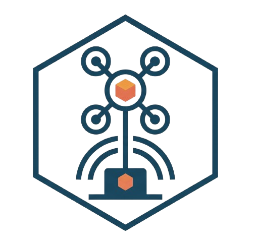

<p align="center">
  
</p>

<h1 align="center">JORC</h1>

<p align="center">
  <b>Joint Task Offloading and Resource Allocation with Data Caching in UAV-Aided Mobile Edge Computing</b><br>
  A close, open-source implementation of the <i>Sensors</i> 2026 paper
</p>

<p align="center">
  <a href="https://www.mdpi.com/1424-8220/26/15/4966"></a>
  <a href="https://doi.org/10.3390/s26154966"></a>
  
  
  
  
</p>

---

## Overview

This repository is a close implementation of

> T. Baidya and S. Moh, "Joint Task Offloading and Resource Allocation with Data Caching in UAV-Aided Mobile
> Edge Computing Networks for Latency-Sensitive Applications," *Sensors*, vol. 26, 4966, 2026.
> [https://www.mdpi.com/1424-8220/26/15/4966](https://www.mdpi.com/1424-8220/26/15/4966)

In JORC, user devices offload computation tasks to UAVs equipped with edge servers, which can further forward
them to a base station. A **soft actor-critic (SAC)** agent jointly decides where each task runs and how much
transmit power and CPU it receives. A **hybrid LFU-LRU cache** stores task results so repeated requests are
served without recomputation.

> **Status:** The exact implementation is under development for further analysis.

## Table of contents

- [Highlights](#highlights)
- [Quick start](#quick-start)
- [How it works](#how-it-works)
- [Repository structure](#repository-structure)
- [Running experiments](#running-experiments)
- [Configuration](#configuration)
- [Reproducibility](#reproducibility)
- [Testing](#testing)
- [Roadmap](#roadmap)
- [Contributing](#contributing)
- [Citation](#citation)
- [License](#license)

## Highlights

- **Complete method:** system model, optimisation problem, SAC agent (Alg. 1) and hybrid caching (Alg. 2)
- **All baselines:** PPO, DDPG and A3C with caching; SAC without caching; LFU, LRU and Random replacement
- **Every figure scripted:** experiment definitions and plotting for Figs. 3–15
- **Traceable equations:** each paper equation maps to a named function in the code
- **Parameter provenance:** every value in the config is tagged by its source (paper, literature or implementation choice)
- **Reproducible by design:** fixed seeds, common random numbers across methods, raw JSON per run, resumable sweeps
- **Statistics included:** 95 % confidence intervals over seeds and paired Wilcoxon signed-rank tests
- **Tested:** 25 unit and integration tests covering equations, constraints, caching and the learning agent

## Quick start

```bash
git clone <repository-url> && cd jorc-reproduction
python -m venv .venv && source .venv/bin/activate
pip install -r requirements.txt          # or: conda env create -f environment.yml

python -m pytest -q tests                # verify the installation (~1 min)
bash scripts/run_all.sh smoke            # run the full pipeline at a small scale
```

Tested with Python 3.12, PyTorch 2.5.1 (CPU), NumPy 2.x and SciPy 1.x.

## How it works

### System model

| Component | Description |
|---|---|
| Network | One base station at (0, 0), M UAVs at altitude H = 100 m, N user devices |
| Channel | Line-of-sight gain h = h₀ / (H² + d²); OFDMA uplink R = Bₙ log₂(1 + P h / (Bₙ N₀)) |
| Execution options | Locally on the device, on the assigned UAV, or on the base station via the UAV backhaul |
| Cost | Cₙ = 0.5 · L / Lᵐᵃˣ + 0.5 · E / Eᵐᵃˣ, summed over users |
| Constraints | One execution location per task, deadlines, 0 < P ≤ Pₘₐₓ, total CPU share ≤ 1 per server |
| Caching | Results of tasks executed on a UAV or the base station are cached there and reused on repeat requests |

### Algorithm

1. **Cache check:** each request is looked up in the UAV cache, then the base-station cache. Hits are served immediately.
2. **SAC decision:** for cache misses, the actor outputs five values per user: three location scores (argmax gives the execution site), a transmit power and a CPU share.
3. **Execution:** latency, energy and cost follow eqs. (4)–(17); the reward is the negative system cost.
4. **Caching:** new results are inserted; when a cache is full, the entry with the lowest score
   H(T) = δ·F(T) + (1 − δ)/(t − L(T)) is evicted, and δ adapts to the observed request repetition rate.

**SAC settings:** twin critics with target networks, automatic temperature (α₀ = 0.2, target entropy −5N),
3 × 400 ReLU layers, Adam (lr 1e-4), γ = 0.8, τ = 0.005, replay buffer 10⁶, batch 64, one gradient step per
environment step.

### Paper equations in the code

| Paper | Code |
|---|---|
| Eq. (1)–(2): channel and uplink rate | `src/jorc/channel_model.py` |
| Eq. (4)–(17): latency, energy, cost | `src/jorc/cost_model.py` |
| Eq. (19e), (19f), (21a), (21b): constraints and action decoding | `src/jorc/offloading.py` |
| Eq. (20)–(22): state, action, reward | `src/jorc/env.py` |
| Eq. (23)–(32), Algorithm 1: SAC | `src/jorc/agents/sac.py` |
| Eq. (14), (33), (34), Algorithm 2: caching | `src/jorc/caching.py`, `src/jorc/env.py` |
| Sec. 6.3: performance metrics | `src/jorc/metrics.py` |

## Repository structure

```
jorc-reproduction/
├── configs/
│   ├── paper_default.yaml       # all parameters, tagged by source
│   ├── figures.yaml             # experiment definitions for Figs. 3–15
│   ├── baselines.yaml           # compared methods and cache policies
│   ├── scales.yaml              # compute profiles: smoke | reduced | paper
│   └── sensitivity.yaml         # parameter variations
├── src/jorc/
│   ├── channel_model.py         # channel, coverage, backhaul
│   ├── task_model.py            # task catalogue and request popularity
│   ├── system_model.py          # BS / UAV / device geometry and mobility
│   ├── cost_model.py            # latency, energy and cost
│   ├── offloading.py            # action decoding and constraint projection
│   ├── caching.py               # hybrid LFU-LRU, LFU, LRU, Random caches
│   ├── env.py                   # MDP environment
│   ├── agents/                  # SAC, PPO, DDPG, A3C
│   ├── baselines.py             # method registry
│   ├── training.py              # training and evaluation loops
│   ├── metrics.py               # performance metrics
│   ├── diagnostics.py           # training-free reference policies
│   └── utils.py                 # config loading, units, seeding, statistics
├── experiments/
│   ├── run_main_experiment.py   # one method / configuration / seed
│   ├── reproduce_figures.py     # Figs. 3–15
│   ├── reproduce_tables.py      # parameter table, comparisons, significance tests
│   ├── sensitivity_analysis.py  # parameter sensitivity
│   └── cache_capacity_diagnostic.py
├── tests/                       # 25 tests
├── data/                        # values stated in the paper (for comparison)
├── scripts/run_all.sh           # end-to-end pipeline
└── results/                     # generated outputs
```

## Running experiments

### Single run

```bash
# JORC at the paper's default point (N = 100 users, M = 2 UAVs), seed 0
python experiments/run_main_experiment.py --method JORC --scale paper --seeds 0 --checkpoint
```

Available methods: `JORC`, `"PPO with caching"`, `"DDPG with caching"`, `"A3C with caching"`, `"SAC without caching"`.

### Figures

| Figure(s) | What varies | Metric(s) | Command flag |
|---|---|---|---|
| 3 | Training episodes | Episode reward | `--figures fig3` |
| 4, 5, 6, 7, 12 | Number of users (20–120) | Latency, energy, cost, STCR, offloading ratio | `--figures fig4_7_12` |
| 8, 9, 10, 11, 13 | Number of UAVs (1–8) | Latency, energy, cost, STCR, offloading ratio | `--figures fig8_11_13` |
| 14 | UAV cache capacity (2–32 GB) | Cache hit ratio at UAVs | `--figures fig14` |
| 15 | BS cache capacity (10–160 GB) | Cache hit ratio at BS | `--figures fig15` |

```bash
python experiments/reproduce_figures.py --scale paper                       # all figures
python experiments/reproduce_figures.py --scale paper --figures fig4_7_12   # a subset
```

Sweeps are resumable: each completed run is saved as JSON and skipped on restart.

### Tables and analysis

```bash
python experiments/reproduce_tables.py --scale paper          # provenance, comparison, Wilcoxon tables
python experiments/sensitivity_analysis.py                    # training-free sensitivity (minutes)
python experiments/sensitivity_analysis.py --train --scale reduced
python experiments/cache_capacity_diagnostic.py --units GB
```

### Compute scales

| Scale | Episodes × steps | Seeds | Purpose |
|---|---|---|---|
| `smoke` | 4 × 50 | 2 | Pipeline check (minutes) |
| `reduced` | 40 × 100 | 3 | Quick exploration |
| `paper` | 2000 × 1000 | 10 | Paper training budget (~26 CPU-hours per run at N = 100) |

Results under `results/smoke/` come from the pipeline check, not a paper-scale run.

### Outputs

| Command | Output |
|---|---|
| `reproduce_figures.py` | `results/<scale>/figures/fig*.png` and `.json` (mean, 95 % CI, per-seed values) |
| `reproduce_tables.py` | `results/<scale>/tables/{parameter_provenance,comparison,wilcoxon}.md` |
| `sensitivity_analysis.py` | `results/sensitivity/sensitivity.md` |
| `cache_capacity_diagnostic.py` | `results/cache_diagnostic/*.png` and `.json` |

## Configuration

All parameters live in [`configs/paper_default.yaml`](configs/paper_default.yaml). Override any of them from the
command line:

```bash
python experiments/reproduce_figures.py --scale reduced --set system.n_users=60 caching.policy=lru
```

### Key parameters

| Parameter | Value | Source |
|---|---|---|
| Users N, UAVs M, altitude H | 100, 2, 100 m | Paper |
| Bandwidth B, reference gain h₀ | 20 MHz, −50 dB | Paper |
| Task size, result size | [2, 10] Mbit, [0.1, 1] Mbit | Paper |
| Workload, deadline | [600, 750] cycles/bit, [1, 7] s | Paper |
| CPU: device, UAV, BS | [0.5, 0.75] GHz, 10 GHz, 50 GHz | Paper |
| Energy coefficient k | 10⁻²⁷ | Paper |
| Cost weights, Eᵐᵃˣ | 0.5 / 0.5, 20 J | Paper |
| Cache: UAV, BS | 2 GB, 10 GB | Paper |
| Cache adaptation: W, η, r_th | 50, 0.05, 0.5 | Paper |
| Noise PSD N₀ | −174 dBm/Hz | Literature (3GPP) |
| Transmit power: device, UAV | 0.2 W, 1 W | Literature |
| Beamwidth, UAV layout, user placement | 60°, ring of 500 m, within coverage | Implementation choice |
| Task catalogue, popularity | 200 000 tasks, Zipf 0.8 | Implementation choice / literature |
| δ₀, δ_min, δ_max | 0.5, 0.1, 0.9 | Implementation choice |

Every parameter's source and rationale is documented in
[`REPRODUCTION_ASSUMPTIONS.md`](REPRODUCTION_ASSUMPTIONS.md). The full table is generated by `reproduce_tables.py`.

## Reproducibility

- **Seeds:** runs use seeds 0–9 (`training.seeds`). Each seed fixes the task catalogue, UAV layout and network
  initialisation.
- **Common random numbers:** episode *e* uses `SeedSequence([seed, e])` for every method, so methods are compared
  on identical scenarios. Evaluation uses held-out episodes (`SeedSequence([seed + 100000, e])`).
- **Raw results:** every run saves its full configuration, training history and evaluation metrics as JSON.
- **Safe interruption:** results are written atomically, so an interrupted sweep never leaves corrupted files.
- **Statistics:** figures report means with 95 % t-intervals over seeds; JORC is compared with each baseline
  using paired Wilcoxon signed-rank tests.

## Testing

```bash
python -m pytest -q tests
```

| Test file | Covers |
|---|---|
| `test_channel.py` | Channel gain, Shannon rate, coverage radius, unit conversions |
| `test_latency.py` | Local, UAV and BS latency |
| `test_energy.py` | Transmission and computation energy, cost function |
| `test_constraints.py` | One-hot offloading, power bounds, CPU capacity, coverage, cache capacity |
| `test_caching.py` | Hybrid score, δ adaptation, LFU/LRU eviction, variable-size capacity |
| `test_optimization.py` | SAC target entropy, tanh log-probability, toy convergence, determinism |

## Roadmap

- [x] System model, cost model and constraints
- [x] SAC agent and hybrid LFU-LRU caching
- [x] PPO, DDPG, A3C and cache-replacement baselines
- [x] Experiment pipelines for Figs. 3–15
- [x] Test suite
- [ ] Paper-scale training runs for all figures
- [ ] Published result figures and tables
- [ ] Pretrained checkpoints
- [ ] Continuous integration

## Contributing

Contributions are welcome.

1. Open an issue to discuss bugs, questions or proposed changes.
2. Fork the repository and create a feature branch.
3. Run `python -m pytest -q tests` before submitting a pull request.
4. Add new modelling choices as configuration keys with a source tag in `configs/paper_default.yaml`, and
   document them in `REPRODUCTION_ASSUMPTIONS.md`.

## Citation

If you use this code, please cite the original paper:

```bibtex
@article{baidya2026jorc,
  author  = {Baidya, Tanmay and Moh, Sangman},
  title   = {Joint Task Offloading and Resource Allocation with Data Caching in {UAV}-Aided Mobile Edge
             Computing Networks for Latency-Sensitive Applications},
  journal = {Sensors},
  volume  = {26},
  pages   = {4966},
  year    = {2026},
  doi     = {10.3390/s26154966}
}
```

## License

This project is released under the [MIT License](LICENSE).

## Acknowledgements

This is an independent implementation. Credit for the JORC framework belongs to the original authors,
T. Baidya and S. Moh. The SAC implementation follows Haarnoja et al., "Soft Actor-Critic Algorithms and
Applications" (2018).
